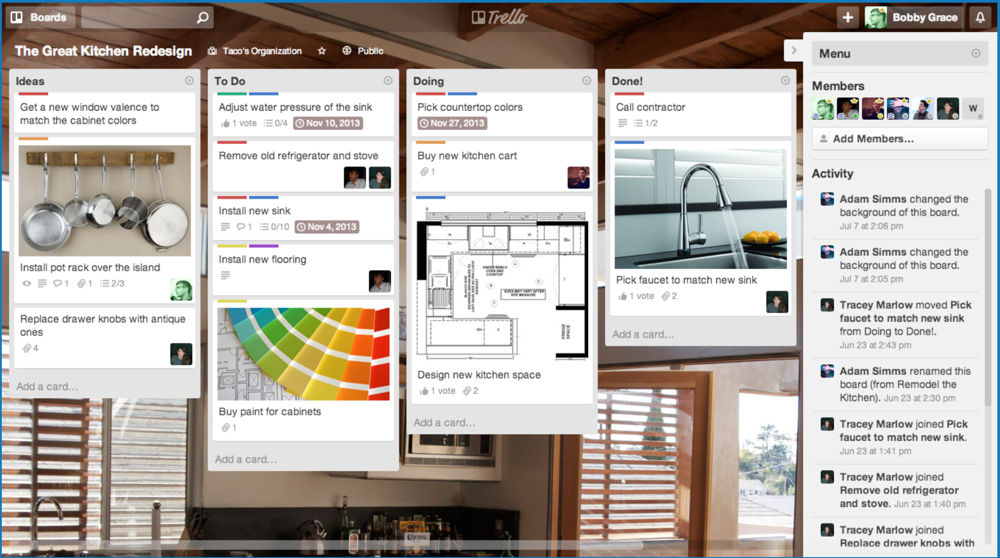

# Soft Skills Curriculum & Resources

## Overview of Soft Skills Instruction at Turing
Soft Skills instruction at Turing is a three-fold focus:
  * Pre-Turing: Before students begin at Turing, they are given a survey to self-assess their soft skills. The Community Affairs Manager (Allison) will use this information to create initial plans for students. 
  * During Turing (Mods. 1-3): Allison will meet with students during each module to continue development on soft skills, either in small groups or in 1-on-1 meetings. Cohort-specific sessions called Protocol will be taught 
  * Preparing for Post-Turing (Mod. 4): In Module 4, students will meet with the Professional Development Coordinator (Marissa) and the Partnerships Manager (Lia) to discuss and create strategies for the search for jobs in the software industry. 
  
See more on our approach to soft skills curriculum [here](https://docs.google.com/document/d/13Ojfj3YpqNYIHHI3tvhOvjZE3mvTd91F5IK0-fL1rEM/edit?usp=sharing). 

Below is a listing of soft skills areas along with links to relevant tools and lesson plans:

## Resources for Identifying Your Strengths & Areas of Improvement:
* [Guidelines for signing up for StrengthsFinder]
* [StrengthsFinder Themes: Adapted for Professional Developers](https://docs.google.com/document/d/1D4AE3y8yVXx5PI7wtPcbdTEz-IbXl6CJm_EZAwkTHew/edit?usp=sharing)

## Study Skills
*

## Communication Skills
* Collaborating with others
* Listening
* Presentation & Public Speaking Skills
* Technical Blogging
     * [Getting Started Writing a Blog](https://docs.google.com/document/d/1Eeg1rbk_AIIztpzNI62PZSbN1KjUJZYGrwzHwSHX69o/edit?usp=sharing)
     * [Diving Deeper Into Technical Blogs]()
     * [Revising Blog Posts]()
     * [List of Tech. Blogs for reference](https://docs.google.com/a/casimircreative.com/document/d/14Z2CsY71j6py5eTA8LZWTmQ7Jb3LY0G8_IKbTo8ikoU/edit?usp=sharing)
*  

## Communication Management
* [Slack](https://docs.google.com/document/d/1OChnYx0ViErOKgNzE6C0hDD9tC9xX683f_dlM_4WYkA/edit?usp=sharing)
* Email

## Impostor Syndrome & Resiliency
* [Reading: A Quick Note on Getting Better at Difficult Things by Ta-Nehisi Coates](http://www.theatlantic.com/education/archive/2015/03/a-quick-note-on-getting-better-at-difficult-things/387133/)

## Time Management & Organizational Resources
* [Todoist](https://todoist.com): This site provides  
* [Google Calendar]
* [Trello](trello.com)

* [Waffle.io](waffle.io)

* [Workflowy](https://workflowy.com): This site provides 

## Stress Management & Personal Development
* Assertiveness & Self Confidence
* Building Self-Awareness
* Building Emotional Self-Awareness
* Work-Life Balance
* 

## Working in Teams & Leadership Skills
* [Define the Relationship (DTR)](https://docs.google.com/document/d/1zMtgWhODQuP3KBNhrg6PtmPUkw0DIskqgggeyEzYZi4/edit?usp=sharing)
* Team Building
* Project Management
* Remote Teams
* Mentoring
* 

## Creativity
* Innovation
* Developing Interests
* Side Projects
* Resource:
     * [TED Talk: Adam Grant, The Surprising Habits of Original Thinkers](https://www.ted.com/talks/adam_grant_the_surprising_habits_of_original_thinkers?language=en)

## Career Exploration
* [Telling Your Story](https://docs.google.com/document/d/1ux3j3Cp6PZq1EzFH9jy8PbQiXn3N32W7EMAyqRVkVu4/edit?usp=sharing)
