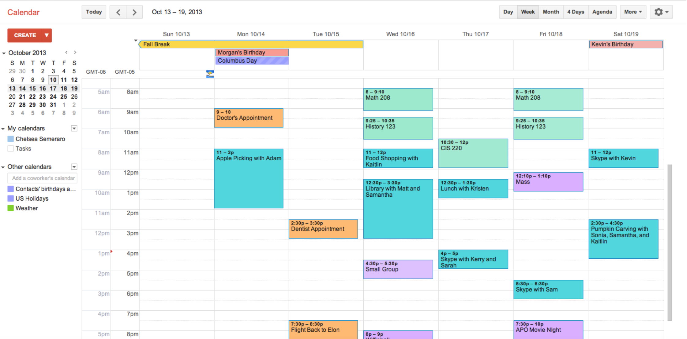

# Professional Skills Curriculum & Resources

## Overview of Professional Skills Instruction at Turing
Professional Skills instruction at Turing is a three-fold focus:
  * Pre-Turing: 
     * Before students begin at Turing, they are given a survey to self-assess their professional skills. The Community Affairs Manager (Allison) will use this information to create initial action plans and suggestions for students. 
  * During Turing (Mods. 1-4): 
     * Allison will meet with students during each module to continue development on professional skills, either in small groups or in 1-on-1 meetings. 
     * In Module 1, students are also provided with the opportunity to take the [StrengthsFinder assessment](http://strengths.gallup.com/110440/About-StrengthsFinder-20.aspx), and Allison will discuss these results with students and assist in creating action plans to highlight strengths within professional development at Turing. Students may also participate in weekly StrengthsFinder lunches to continue the discussion (check the [Turing Community Calendar](https://calendar.google.com/calendar/embed?src=casimircreative.com_ronr9dk92ndvlhsk03kf8jd2ro%40group.calendar.google.com&ctz=America/Denver) for most up-to-date listings of lunches). 
     * Each cohort will participate in 1-2 whole-group sessions each module on professional skills called Protocol to expand on skills that are most applicable to each module.  
  * Post-Turing (Alumni): 
     * Upon graduation, students are provided with opportunities to continue developing their professional skills through support sessions within our Turing Alumni Chapters and can attend any sessions or utilize any resources offered by Turing. 
     * Alumni are also welcome to set up meetings with Allison to finetune skills during their job search. 
  
See more on our approach to professional skills curriculum [here](https://docs.google.com/document/d/13Ojfj3YpqNYIHHI3tvhOvjZE3mvTd91F5IK0-fL1rEM/edit?usp=sharing). 

Below is a listing of professional skills areas along with links to relevant tools and lesson plans:

## Resources for Identifying Your Strengths & Areas of Improvement:
* [Guidelines for signing up for StrengthsFinder]
* [StrengthsFinder Themes: Adapted for Professional Developers](https://docs.google.com/document/d/1D4AE3y8yVXx5PI7wtPcbdTEz-IbXl6CJm_EZAwkTHew/edit?usp=sharing)

## Study Skills
* 

## Communication Skills
* Collaborating with others
* Listening
* Presentation & Public Speaking Skills
* Technical Blogging
     * [Getting Started Writing a Blog](https://docs.google.com/document/d/1Eeg1rbk_AIIztpzNI62PZSbN1KjUJZYGrwzHwSHX69o/edit?usp=sharing)
     * [Diving Deeper Into Technical Blogs]()
     * [Revising Blog Posts]()
     * [List of Tech. Blogs for reference](https://docs.google.com/a/casimircreative.com/document/d/14Z2CsY71j6py5eTA8LZWTmQ7Jb3LY0G8_IKbTo8ikoU/edit?usp=sharing)
*  

## Working in Teams & Leadership Skills
* [Define the Relationship (DTR)](https://docs.google.com/document/d/1zMtgWhODQuP3KBNhrg6PtmPUkw0DIskqgggeyEzYZi4/edit?usp=sharing)
* [Giving & Receiving Feedback](https://docs.google.com/document/d/1xwAHzPKWEMwKMJmvb9HSu3Nku4SFTFtyxIV5TU3NOjw/edit?usp=sharing)
* Team Building
* Project Management
* Remote Teams
* Mentoring
* 

## Communication Management
* [Slack](https://docs.google.com/document/d/1OChnYx0ViErOKgNzE6C0hDD9tC9xX683f_dlM_4WYkA/edit?usp=sharing)
* Email

## Impostor Syndrome & Resiliency
* [Reading: A Quick Note on Getting Better at Difficult Things by Ta-Nehisi Coates](http://www.theatlantic.com/education/archive/2015/03/a-quick-note-on-getting-better-at-difficult-things/387133/)

## Stress Management & Personal Development
* Assertiveness & Self Confidence
* Building Self-Awareness
* Building Emotional Self-Awareness
* Work-Life Balance
* 

## Creativity: Building Habits & Frameworks
Creativity lessons were adapted from [Disciplined Dreaming by Josh Linkner](https://www.amazon.com/Disciplined-Dreaming-Proven-Breakthrough-Creativity/dp/1611203074)
* Creativity Self-Assessment (Step 1)
* [Overview of Disciplined Dreaming Framework](file:///Users/allisonreusinger/Downloads/161005-5-steps-disciplined-dreaming-slideshare-final-151106144051-lva1-app6892%20(1).pdf) (Step 2)
* [Creativity Brief](https://docs.google.com/document/d/13M1XuCQIt7_26GHFAnfnB_prlb36KGRO-E-QKklFosI/edit?usp=sharing) (Step 3)
     * Or, use the [Creativity Brief Lite](https://docs.google.com/document/d/199sWbexvVbwpayRN2J5Mcj-XWNjUHxvHUGLgA4M-g-g/edit?usp=sharing)
* Activities to fulfill Step 4 (do 1 or as many as you want)
     * Name That Ship
     * Creative Visualization
     * 
* Risk-Taking & Failing: How to Make These into Opportunities
* [Slides used in Module 3 Small Groups](https://docs.google.com/presentation/d/10Fodv-7-0CGm0HMUdKvDvlHsZ1yJSdV-VOqdavfRzVw/edit?usp=sharing)
* Other Resources:
     * [TED Talk: Adam Grant, The Surprising Habits of Original Thinkers](https://www.ted.com/talks/adam_grant_the_surprising_habits_of_original_thinkers)
     * [TED Talk: Elizabeth Gilbert, Your Elusive Creative Genius](https://www.ted.com/talks/elizabeth_gilbert_on_genius)
     * [Article: Fear is Boring, and Other Tips for Living a Creative Life by Elizabeth Gilbert](http://ideas.ted.com/fear-is-boring-and-other-tips-for-living-a-creative-life/)
     * [Article: Automatic Creativity: How to Make Creative Thinking into a Habit by David Masters](http://business.tutsplus.com/tutorials/automatic-creativity-how-to-make-creative-thinking-into-a-habit--cms-22181)

## Career Exploration
* [Telling Your Story](https://docs.google.com/document/d/1ux3j3Cp6PZq1EzFH9jy8PbQiXn3N32W7EMAyqRVkVu4/edit?usp=sharing)
* 

## Personal Branding
* [LinkedIn]
* 

## Project Management & Organizational Resources
* [Todoist](https://todoist.com): This site provides a way to create to-do lists complete with sub-tasks, sub-projects, and sharing and collaborating with others. You can create ways to prioritize your to-dos as well.

* [Google Calendar](https://calendar.google.com/calendar/): Use your Google Calendar to keep track of events and due dates at Turing as well as make appointments with your team. 

* [Trello](trello.com): 

* [Waffle.io](waffle.io): 

* [Wunderlist](
* [Workflowy](https://workflowy.com): 

